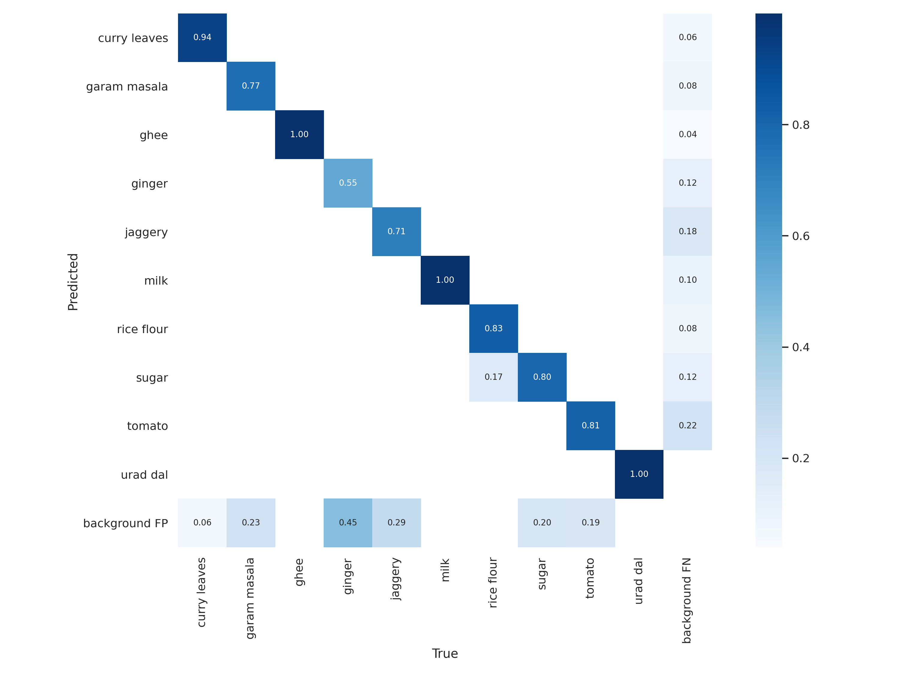
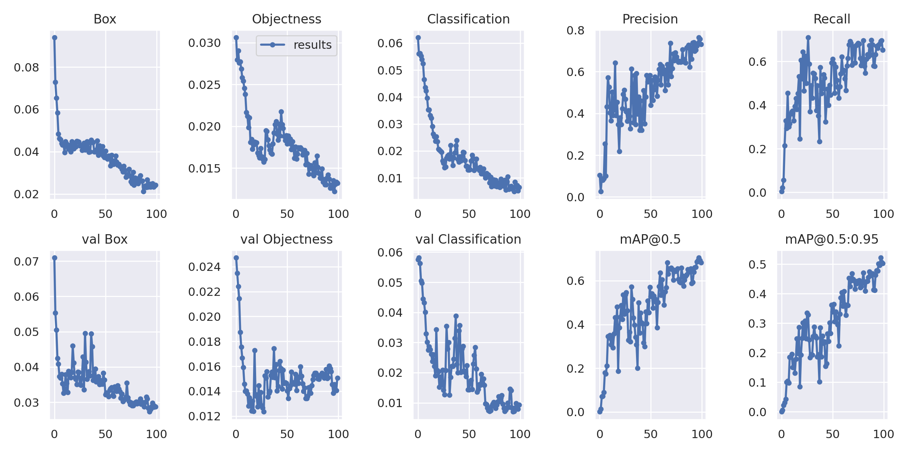
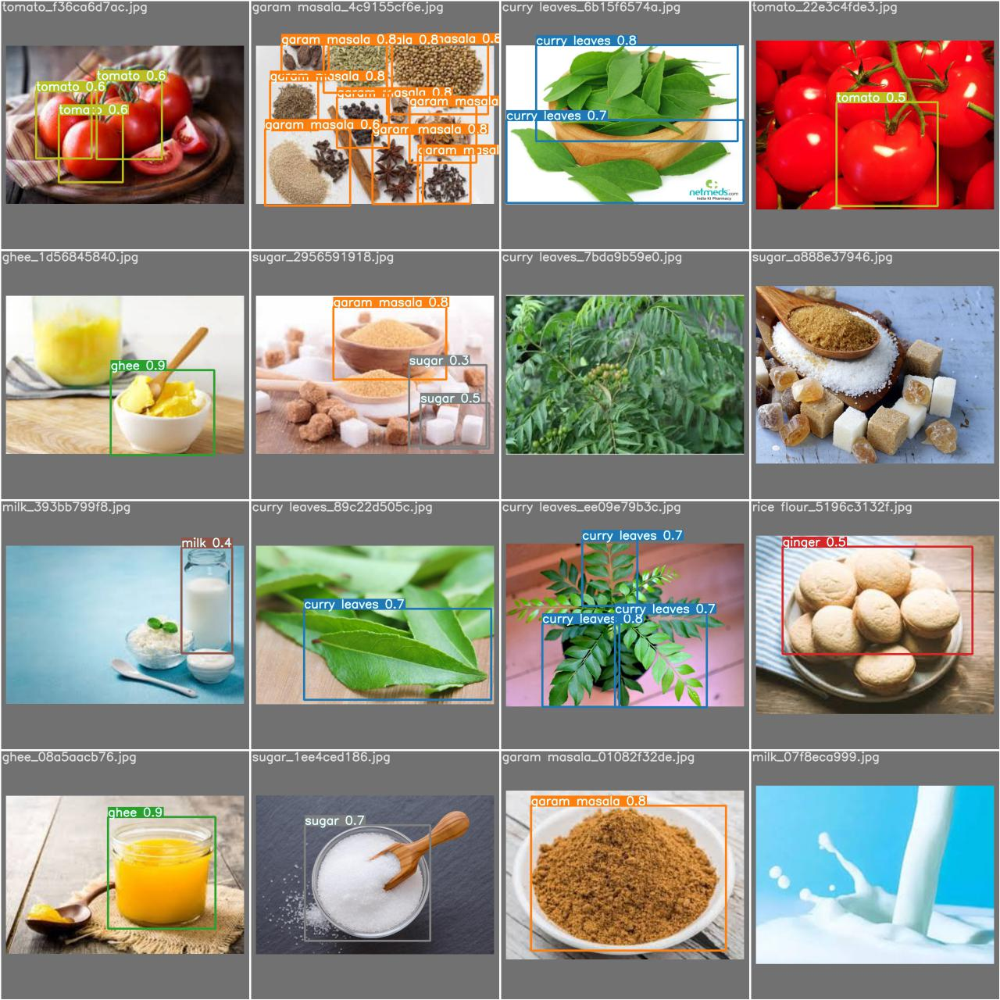

# Mystery Box Challenge (MBC App) :cookie: - Object Detection Model

An instance of [YOLOv5](https://github.com/ultralytics/yolov5) trained on custom dataset of food ingredients, collected and annotated manually.

Following are the model parameters used:

<table style="width:100%">
  <tr>
    <th>Model parameters</th>
    <th>Value</th>
  </tr>
  <tr>
    <td>Model configuration</td>
    <td>yolov5m</td>
  </tr>
  <tr>
    <td>Image size</td>
    <td>640</td>
  </tr>
  <tr>
    <td>Number of epochs</td>
    <td>100</td>
  </tr>
  <tr>
    <td>Training batch size</td>
    <td>16</td>
  </tr>
  <tr>
    <td>Number of classes</td>
    <td>10</td>
  </tr>
  <tr>
    <td>Inference batch size</td>
    <td>1</td>
  </tr>
</table>

It must be noted that the following model can be extended(or reconfigured) for more than 10 classes with further inclusion of data from different classes in the same manner as it has currently been done.

After training, the default export scirpt for the yolov5 project was modified to make sure the outputs of the inference instance are {bounding boxes, confidence, class}. Below are some visual results of the model training:

### Connected repositories

-   [MBC Application](https://github.com/himanshu-dutta/mystery-box-challenge-app)

### Reference

-   [Indian Food 101](https://www.kaggle.com/nehaprabhavalkar/indian-food-101)
